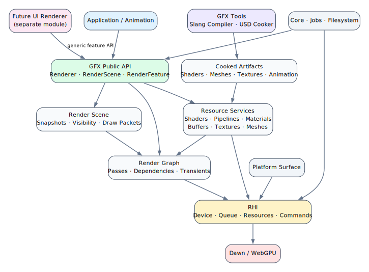
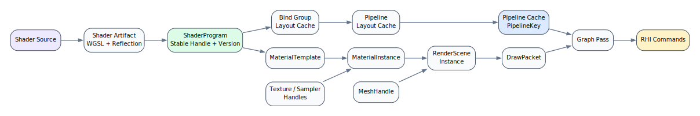
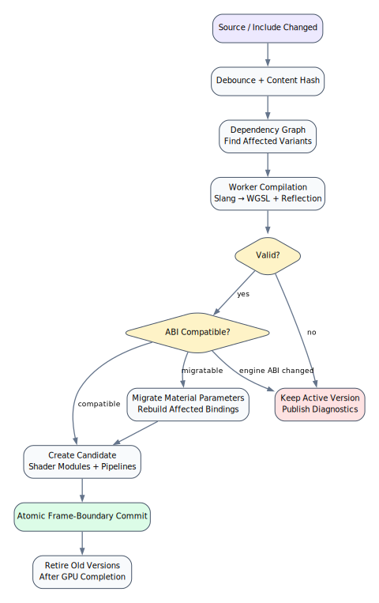
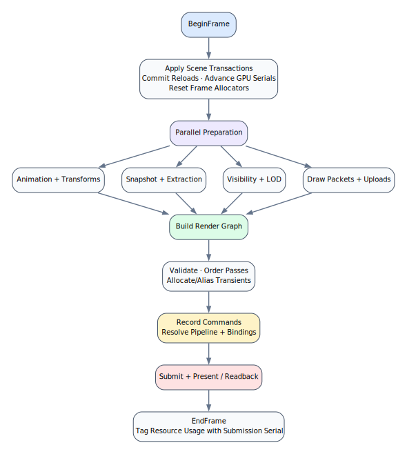
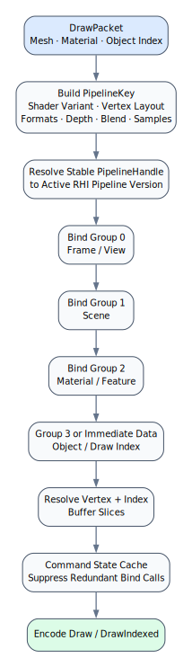

# GFX Renderer Architecture

This document captures the high-level structure of the GFX rendering module. GFX sits above RHI and owns rendering policy, reusable GPU resources, scene extraction, render-graph scheduling, and extensibility.

## Module boundaries

- RHI provides raw GPU resources and command encoding.
- GFX owns shaders, pipelines, materials, buffers, textures, scenes, features, and frame scheduling.
- Offline tools compile shaders and cook source assets into runtime artifacts.
- Applications, animation, and independent render modules use the public GFX API.

## Resource relationships

Resources use stable typed handles. Shaders produce layouts and pipelines; materials reference those pipelines and textures; scene instances reference meshes and materials; draw packets resolve everything during render-pass execution.

Shared resources are cached by content or normalized descriptors. Replaced GPU versions remain alive until their final GPU submission completes.

## Shader hot reload

Shader files and recursive includes are tracked by dependency. At the beginning of a frame, changed
shaders are synchronously recompiled and their dependent pipelines are rebuilt. A failed shader
compile preserves the previous shader modules. A failed dependent pipeline rebuild remains queued
and is retried on later frames; a newer source edit supersedes the retry with the latest shader.
Diagnostics report reloads, retries, pending sets, and failures. Transactional replacement of an
entire multi-shader set is not implemented yet.

## Frame lifecycle

Scene extraction creates an immutable frame snapshot. Optional bounding spheres are culled against a
supplied frustum before opaque and transparent queues are built. Features prepare draw state and
uploads synchronously, then the render graph orders passes, manages transient textures, records
commands, and submits the frame.

## Draw resolution

Draw packets contain logical handles rather than raw RHI pointers. Before graph execution, GFX
resolves active pipelines, standardized binding groups, geometry slices, and draw parameters. The
draw encoder avoids redundant pipeline, vertex-buffer, and index-buffer state changes while encoding
contiguous batches.

## External render modules

Independent render modules integrate through the generic render-feature API. They can manage their own shaders and pipelines, allocate dynamic buffers, register render-graph passes, and render to imported or offscreen targets without owning the RHI device or bypassing graph validation.

The future UI renderer remains separate from GFX and uses these same generic facilities.

## Built-in shading

`StandardShaderLibrary` describes file-backed, hot-reloadable unlit, numeric PBR, textured PBR,
shadowed PBR, environment PBR, full PBR, skinned PBR, masked-depth, and tone-mapping shaders. Shared
WGSL files provide object transforms, BRDF functions, shadow sampling, environment sampling, and
lighting functions through the normal shader include system. Standard interfaces
reserve independent binding groups for per-object data, material parameters, frame lighting/shadows,
and skin palettes.

The PBR paths implement base color, emissive, metallic, roughness, normal, occlusion, and alpha-mask
inputs with directional, point, and spot lights. Missing material maps bind deterministic 1x1
fallback textures. A shadow feature renders a selected shadow-casting light into graph-owned depth.
`PbrFull` combines material textures, alpha masking, direct lights, selected-light shadows, split-sum
image-based lighting, ambient occlusion, and emissive output in the primary production path. The
`PbrFullSkinned` uses the same shared surface implementation after GPU joint deformation, so animated
geometry retains the complete material and lighting path. Its vertex contract is position at location
0, normal at 1, UV at 2, four joint indices at 3, and four weights at 4. The smaller variants remain
useful for constrained passes and debugging. Cascaded and atlas shadows remain future extensions.

Skinned shadow pipelines use `DepthSkinned` for opaque materials and `DepthMaskedSkinned` for cutout
materials. Both consume the same joint palette and locations 3/4 as `PbrFullSkinned`; the masked
variant additionally consumes UV location 2 and the minimal alpha material bindings. Consequently,
shadow silhouettes follow the evaluated animation pose instead of the undeformed bind mesh.

## Animation and skinning

Animation clips contain independent translation, rotation, and scale tracks over a validated
parent-before-child skeleton. Evaluation supports looped and clamped playback and produces local,
global, and inverse-bind-adjusted skin matrices. Render objects may carry an evaluated skin palette;
scene extraction preserves it through immutable snapshots and the draw-binding layer uploads it as
per-draw storage data for skinned shader variants.

`Blend` combines two evaluated poses in local transform space, supports a normalized per-joint mask,
uses spherical rotation interpolation, and reconstructs global and skin matrices from the skeleton.
This supports cross-fades and body-region animation layers without interpolating matrices or breaking
joint hierarchy invariants.

Animation file import is intentionally outside GFX. Importers translate FBX, glTF, or other source
formats into these runtime-neutral clip and skeleton structures.

## Built-in render features

- `DepthPrepassFeature` renders the main opaque queue through registered depth-only material variants
  and publishes main depth before forward shading. Opaque, masked, skinned, and masked-skinned
  materials therefore use their matching depth implementation. Register it before
  `ForwardRenderFeature`; forward rendering validates and loads the published depth instead of
  clearing it.
- `ForwardRenderFeature` renders opaque and transparent queues to either the final output or an
  offscreen HDR texture.
- `ShadowRenderFeature` filters shadow casters and publishes fixed-resolution depth plus typed light
  metadata through the graph blackboard. Opaque depth variants remain vertex-only. Masked materials
  use a depth pipeline with `depth_fragment` enabled and the built-in `DepthMasked` implementation,
  which samples only base-color alpha and applies the material cutoff so foliage and cutouts cast
  correct silhouettes. Standard object bindings are keyed by render-view scope, so shared objects
  receive independent camera and light-view uniforms across passes.
- `PostProcessFeature` consumes an offscreen graph color with a caller-selected fullscreen pipeline.
  Each instance has a unique label and chooses either an intermediate transient output or the final
  per-frame output, allowing ordered chains such as bloom, color grading, and tone mapping. The
  built-in tone-map shader is one ready-to-use pipeline source. Only the last effect in a chain may
  target `PostProcessOutput::Final`.

Feature metadata uses typed blackboard values, while GPU data remains declared as graph resources.
This keeps transient lifetimes inside the graph and creates dependent bindings only when pass-native
resources are available.

Graph resources include textures and buffers with transient, imported, and per-frame ownership.
Buffer inputs have explicit access declarations, participate in the same dependency and lifetime
analysis as textures, and are exposed to pass callbacks by stable input index. Transient buffers are
allocated and reused by the RHI graph; per-frame buffers are bound by the caller. Compatible
transient textures and buffers alias the same native allocation only when their derived pass-lifetime
intervals do not overlap. Diagnostics expose physical transient texture and buffer allocation counts
so graph memory behavior remains observable. This path supports
future GPU-driven visibility, indirect draws, compute-produced data, and external UI geometry without
bypassing graph scheduling.

`GraphPassKind::Compute` records a native compute pass with a typed `ComputePassContext`. Compute
callbacks receive declared buffers and storage-texture views by stable index and use the normal
compute encoder for pipeline binding and dispatch. Writes automatically order later render or
compute readers through the same resource dependency compiler, enabling image filters and GPU post
effects to publish textures for later sampling. Compute passes cannot declare render attachments or
render-sample inputs.

## Pipeline and diagnostics API

`BuildStandardMaterialPipeline` derives consistent raster, blend, depth, attachment, and resolver-key
state for forward, transparent, and depth-only material variants. `CreateStandardMaterialPipeline`
creates and registers the result idempotently. A pipeline may use a specialized
`implementation_shader` while retaining the material's forward shader in its resolver key; draw
bindings always follow the resolved implementation shader's interface.

Renderer diagnostics expose the last frame result, hot-reload failures, CPU timings for maintenance,
planning, graph compilation, upload, execution, and total frame work, plus live and retired GFX
resource counts. When the RHI device enables `TimestampQuery`, the renderer also captures whole-graph
GPU duration into a three-frame readback ring. Readback starts only after the caller reports the
submission complete, never stalls rendering, and records the newest available duration and its
submission in `RendererDiagnostics`. Unsupported devices continue without GPU timings.
